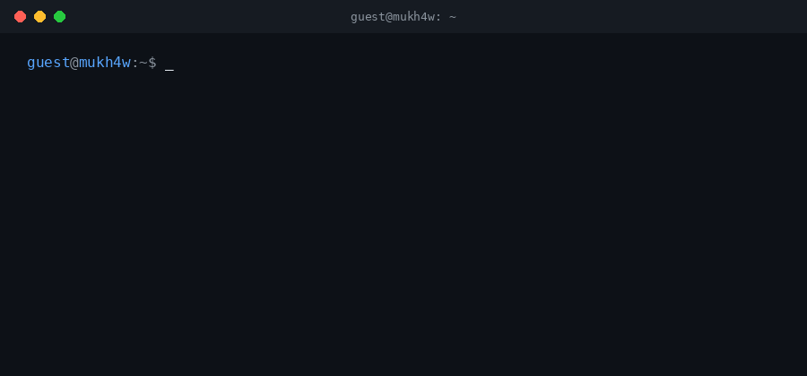

  

## About

Security engineer — penetration testing and bug bounty. I build offensive security tooling and play CTFs (jeopardy and attack/defense) with **FR13NDS TEAM**.

Currently making small TUI-based tools, starting with `rast-tui`. Next up: a lightweight web proxy for security testing — a Burp Suite / Caido–style tool built for the terminal.

Comfortable working in an AI-agentic workflow.

Based in Kazakhstan (Almaty / Astana / Shymkent).

## FR13NDS TEAM

  
  
  

## Tech Stack

  

  
  
  
  
  
  

## Featured Project

**[rast-tui](https://github.com/mukh4w/rast-tui)** — TUI fuzzy launcher for per-directory shell command snippets. Pick a command, edit it in your prompt, run it yourself.

## GitHub Stats

  <a href="https://github.com/jeantimex/neofetch-profile">
    <picture>
      <source media="(prefers-color-scheme: dark)" srcset="https://neofetch-profile.vercel.app/api?username=mukh4w&theme=github-dark">
      
    </picture>
  </a>

## Connect

  
  
  

