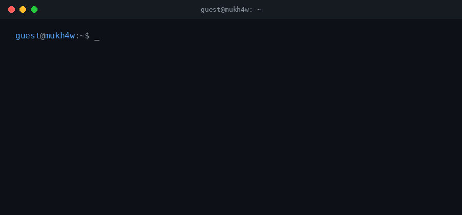

  

<h1 align="center">Hi, I'm Nurislam (mukh4w) 🕵️‍♂️</h1>

<h3 align="center">Offensive Security Engineer | Tool Builder | CTF Player</h3>

  <i>Currently <b>open for internships</b> in Application Security, Red Teaming, or DevSecOps.</i>

---

## 👨‍💻 About Me

I specialize in **Security Engineering**, **Red Team Operations**, and **Vulnerability Research**. I build offensive security tooling and actively compete in CTFs (Jeopardy and Attack/Defense) with **FR13NDS TEAM**. 

When I'm not hunting for bugs or popping shells, I'm developing TUI-based (Terminal User Interface) tools to automate my workflows. I'm highly comfortable working in modern AI-agentic environments to accelerate development and research.

* 📍 **Based in:** Kazakhstan (Almaty / Astana / Shymkent)
* 🚀 **Current Focus:** Building fast, lightweight terminal tools.
* ⚡ **Next Big Project:** A lightweight, terminal-native web proxy for security testing (a CLI alternative to Burp Suite / Caido).

## 🛠 Tech Stack & Arsenal

### Languages & OS

  

### Offensive Tools & C2

  
  
  
  

### AI Workflow

  
  
  

---

## 🔥 Featured Project

**[cbox](https://github.com/mukh4w/cbox)** 
> A blazingly fast TUI fuzzy launcher for per-directory shell command snippets. Pick a command, edit it directly in your prompt, and execute it seamlessly. Built with Rust.

---

## 🏴‍☠️ FR13NDS TEAM & CTF

  
  
  

## 📊 GitHub & System Stats

  <a href="https://github.com/jeantimex/neofetch-profile">
    <picture>
      <source media="(prefers-color-scheme: dark)" srcset="https://neofetch-profile.vercel.app/api?username=mukh4w&theme=github-dark">
      
    </picture>
  </a>

---

## 🔗 Connect With Me

  
  
  

### Security Platforms Profiles

  
  
  
  
  
  

